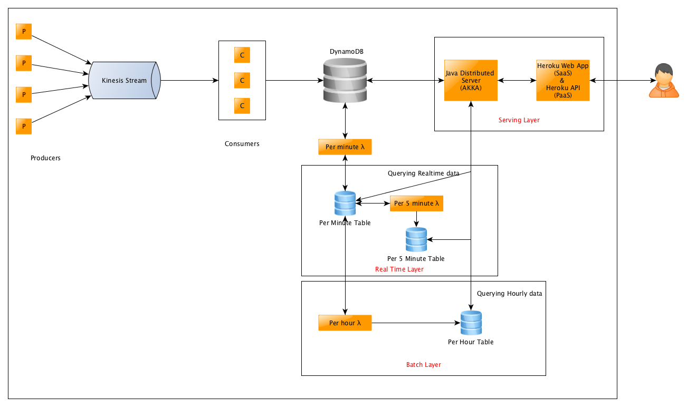

# Twitter-Reddit-Meetup-Real-Time-Analytics

## Code Structure:

### Dependencies for Producer and Consumer Scripts:
* textblob
* boto3
* praw
* TwitterAPI

Please install these dependencies on the machine running the consumer and producer code.

### [Producer](./Producers/):
They fetch the data from Twitter, Reddit and Meetups APIs, tag it with their respective identifier, and put it into the Kinesis stream in a round robin fashion in order to balance the load.

To run producer scripts, please run the following files:

* [producer_meetups.py](./Producers/producer_meetups.py)
* [producer_reddit.py](./Producers/producer_reddit.py)
* [producer_twitter.py](./Producers/producer_twitter.py)

### [Consumer Scripts](./Consumer/):
The consumers read the data from kinesis stream, clean it, extract valuable information and load it into the DynamoDB.

To run the consumer scripts, please run the following file on a node assigning the shard-ids in it beforehand:

* [consumer.py](./Consumer/consumer.py)

### DynamoDB Schemas
The data from the consumers is fed into three tables in DynamoDB: live_table_reddit, live_table_twitter, and live_table_meetups.

There are 6 tables. The details of each is given as:

1.  live_table_reddit
  * key_word (Partition Key)
  * key_datetime (Sort Key)
  * num_comment
  * score

2.  live_table_twitter
  * key_word (Partition Key)
  * key_datetime (Sort Key)
  * favorites
  * replies
  * retweets

3.  live_table_meetups
  * key_word (Partition Key)
  * key_datetime (Sort Key)
  * key_category
  * key_location_city
  * key_location_country
  * key_location_state
  * name
  * venue

4.  per_minute
  * key_word (Partition Key)
  * key_datetime (Sort Key)
  * score

5.  per_5_minute
  * key_word (Partition Key)
  * key_datetime (Sort Key)
  * score
  * rank

6. per_hour
  * key_word (Partition Key)
  * key_datetime (Sort Key)
  * score
  * rank

### [Lambda Functions](./AWS_Lambda):
The data from the live tables is processed per minute by a Lambda function hosted on AWS. It reads all the attributes of given data source per keyword and calculates a score for it. We use these scores to filter our top keywords.

The second lambda functions that run per 5 minutes aggregates the data produced by the per minute lambda, extracts top K keywords for each category, and stores it into the DynamoDB. Thus, it provides the top results for current hour almost instantly.

The hourly lambda function has a similar role in that it aggregates the records generated by the per minute lambda, extracts top K keywords, and creates a historical view.

The lambdas put their output into three tables: per_minute, per_5_minute, and per_hour respectively.

To run the Lambda Functions, please follow the following procedure:

* **Hourly Lambda:**
	* Create Lambda Canary Function on AWS Lambda
	* Add CloudWatch Event with time = 1 hour to the Lambda in the Configuration.
	* Add code from the [Hourly Lambda File](./Lambdas/hourlyLambda.py) to the lambda function.
	* Update the environment variable for AWS Key and Secret.
	* Enable the CloudWatch Trigger.
* **Minute Lambda:**
	* Create Lambda Canary Function on AWS Lambda
	* Add CloudWatch Event with time = 1 minute to the Lambda in the Configuration.
	* Add code from the [Minute Lambda File](./Lambdas/minuteLambda.py) to the lambda function.
	* Update the environment variable for AWS Key and Secret.
	* Enable the CloudWatch Trigger.
* **5 Minute Lambda:**
	* Create Lambda Canary Function on AWS Lambda
	* Add CloudWatch Event with time = 5 minute to the Lambda in the Configuration.
	* Add code from the [5 Minute Lambda File](./Lambdas/fiveMinuteLambda.py) to the lambda function.
	* Update the environment variable for AWS Key and Secret.
	* Enable the CloudWatch Trigger.

## System Architecture:

